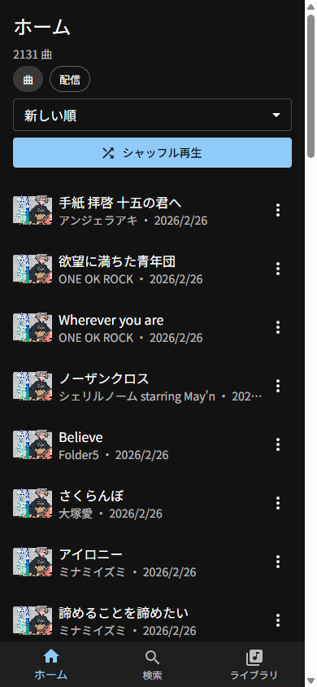
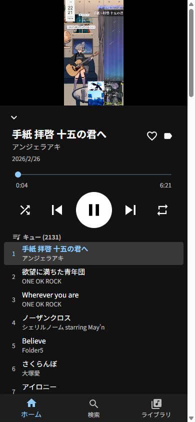
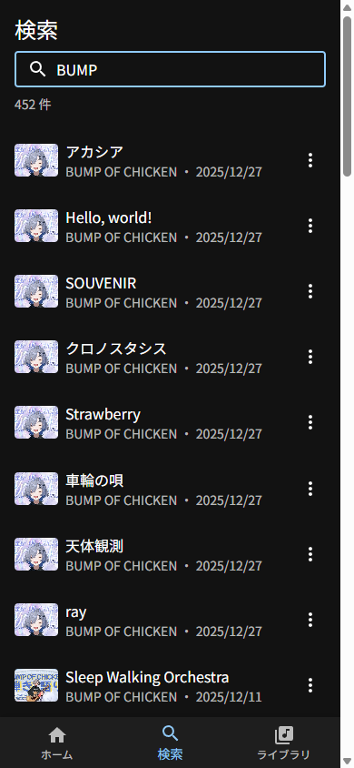
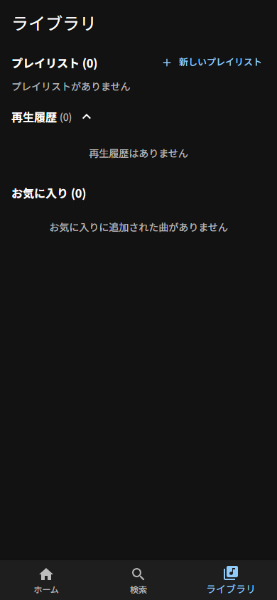

# セトリプレイヤー

YouTubeの歌枠配信のコメント欄からセットリスト（セトリ）を自動抽出し、曲単位で再生できるWebアプリです。

視聴者が投稿したセトリコメントを情報源として活用し、曲名・タイムスタンプを構造化データに変換します。

**Webアプリ:** https://miyatayuya.github.io/setlist-player/

## データの取り扱いについて

本プロジェクトは配信者の権利を尊重し、以下の方針でデータを取り扱っています。

### 音源・映像の非保存

音声ファイルや映像のダウンロード・再配布は一切行いません。再生にはYouTubeの公式埋め込みプレイヤー（IFrame Player API）を使用し、すべての再生はYouTube上で行われます。

### データソースの透明性

本アプリが扱うデータはすべて**公開情報のみ**から取得しています。

| データ | 取得元 | 方法 |
|---|---|---|
| セトリ（曲名・タイムスタンプ） | YouTube動画のコメント欄 | 視聴者が公開コメントとして投稿したセトリを YouTube Data API v3 で取得 |
| 動画メタデータ（タイトル・公開日等） | YouTube Data API v3 | 公式APIによる取得 |
| アーティスト名の補完 | [MusicBrainz](https://musicbrainz.org/) | 曲名をキーにオープンな音楽データベースを検索 |

独自の解析（音声認識・歌詞照合等）は行っていません。

### 保存するデータの範囲

保存するのは曲名・アーティスト名・タイムスタンプ・動画IDなどの**メタデータのみ**です。配信の音声・映像・コメント本文はリポジトリに含まれません。

### 歌唱パフォーマンス一覧

全楽曲のパフォーマンスデータは [`data/song_performances.csv`](data/song_performances.csv) で公開しています。

| カラム | 内容 |
|--------|------|
| `song_name` | 曲名 |
| `artist` | アーティスト名 |
| `video_id` | YouTube動画ID |
| `video_url` | タイムスタンプ付きYouTubeリンク |
| `published_at` | 配信日時 |
| `start_time` | 歌唱開始時刻 (HH:MM:SS) |
| `end_time` | 歌唱終了時刻 (HH:MM:SS) |

CSVの `video_url` をクリックすれば、アプリを使わずに該当の歌唱箇所をYouTubeで直接視聴できます。

## 構成

```
scraper/   セトリ取得・パース・データ補完
data/      生成されたCSVデータ
app/       Webアプリ（React + Vite）
docs/      仕様書・設計ドキュメント
```

## 必要なもの

- Python 3.14+ / [uv](https://docs.astral.sh/uv/)
- Node.js / npm
- YouTube Data API v3 のAPIキー

## データパイプライン

```bash
cd scraper
uv sync
export YOUTUBE_API_KEY="YOUR_API_KEY"
```

### 1. セトリコメントの取得

```bash
uv run fetch_setlists.py
```

`playlists.txt` に記載されたプレイリスト内の各動画のコメントを走査し、セトリコメントを `setlists_raw.json` に保存します。増分更新対応。

### 2. 曲名のパース

```bash
uv run parse_setlists.py
```

セトリコメントをパースし、`data/song_performances.csv` と `data/songs.csv` を出力します。

### 3. アプリ用データの生成

```bash
uv run build_app_data.py
```

タイムスタンプの秒数変換、曲名の表記揺れ統一、ID採番などを行い、以下のファイルを `data/` に出力します。

| ファイル | 内容 |
|---|---|
| `app_songs.csv` | 曲マスタ（song_id, title, artist） |
| `app_performances.csv` | パフォーマンス（performance_id, song_id, video_id, start_seconds, end_seconds） |
| `app_videos.csv` | 動画情報（video_id, title, duration, view_count 等） |

### 4. アーティスト名の補完・正規化

```bash
uv run enrich_songs.py
```

`app_songs.csv` を入力として、以下の処理を行います。

- **非曲エントリの除外** — 雑談・告知などのエントリをフィルタリング
- **CSVパースエラーの修正** — ローマ字表記の曲名を正式名称に変換
- **アーティスト名の注釈分離** — 「(初披露)」「(ワンコーラス)」等を `performance_note` カラムに移動
- **表記ゆれ修正** — タイポ修正、ローマ字→公式表記の統一
- **ビデオコンテキスト補正** — 配信タイトルに含まれるアーティスト名（「BUMPの曲を歌います」等）から推測
- **MusicBrainz API による補完** — 上記で特定できなかった曲について、オープンな音楽データベースで検索

出力:

| ファイル | 内容 |
|---|---|
| `app_songs_enriched.csv` | 補完済み曲マスタ（song_id, title, artist, performance_note） |
| `enrichment_log.json` | 各曲の処理内容・判定理由のログ |

`enrichment_log.json` にはすべての処理の判定理由が記録されており、どの曲がどのように補完・修正されたかを確認できます。

## Webアプリ（app）

```bash
cd app
npm install
npm run dev
```

### 画面

| ホーム | 再生画面 | 検索 | ライブラリ |
|:---:|:---:|:---:|:---:|
|  |  |  |  |

### 機能

- 曲一覧・配信一覧の切り替え表示
- 曲名・アーティスト名での検索（デバウンス付き）
- YouTube埋め込みプレイヤーによる曲単位の再生
- シークバーによる再生位置の表示・操作
- シャッフル再生（キューの並び替え）
- リピート再生
- キュー表示（再生済み・現在・次の曲）
- お気に入り・タグ・プレイリスト管理
- 再生履歴
- 無限スクロール
- MiniPlayer（他の画面でも再生状態を維持）
